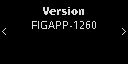

# app-plugin-figment


This plugin allows users to safely interact with [Figment's deposit smart contract](https://etherscan.io/address/0xf0075b3cf8953d3e23b0ef65960913fd97eb5227) by parsing the transaction data and displaying its content in a human-readable way.

The plugin is compatible with the Nano S and Nano X device.

## Build

Before building the plugin, you need to set up a working environment:

```shell
mkdir plugin_dev
cd plugin_dev
```

Inside `plugin_dev`, clone the plugin repository (including submodules):

```shell
git clone --recurse-submodules https://github.com/LedgerHQ/app-plugin-figment
```

You can compile the plugin using a Docker image provided by Ledger.
Make sure you have Docker installed and execute:

```shell
docker pull ghcr.io/ledgerhq/ledger-app-builder/ledger-app-dev-tools
```

Then, start a Docker container and attach a console:

```shell
docker run --rm -ti -v "$(realpath .):/app" ghcr.io/ledgerhq/ledger-app-builder/ledger-app-dev-tools
```

Inside the container, build the plugin by running:

```shell
cd app-plugin-figment
make
```

For more information, see [Setup](https://developers.ledger.com/docs/dapp/embedded-plugin/environment-setup/).

## Test

In order to run a test suite, you need to compile both the plugin and the Ethereum app.

Inside the `plugin_dev` directory, clone the Ethereum application:

```shell
git clone --recurse-submodules https://github.com/LedgerHQ/app-ethereum
```

Then, start a Docker container from within the `plugin_dev` directory:

```shell
docker run --rm -ti -v "$(realpath .):/app" ghcr.io/ledgerhq/ledger-app-builder/ledger-app-dev-tools
```

Inside the container, run the following build script:

```shell
cd app-plugin-figment/tests
./build_local_test_elfs.sh
```

Now you can exit the container and execute the tests:

```shell
cd app-plugin-figment/tests
yarn
yarn test
```

## Screens

### Nano S


### Nano X





